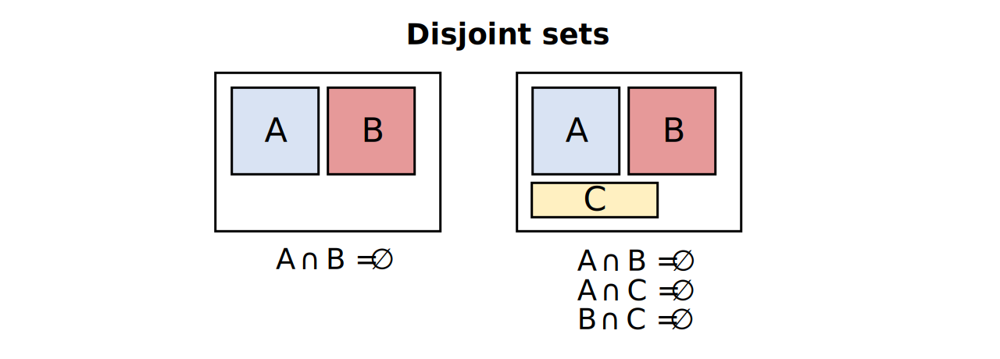
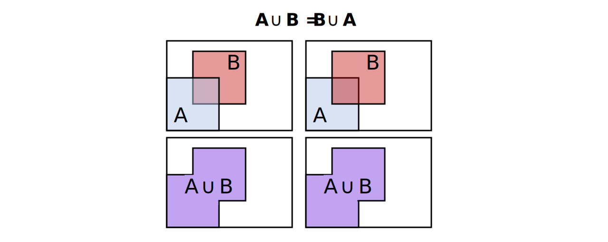
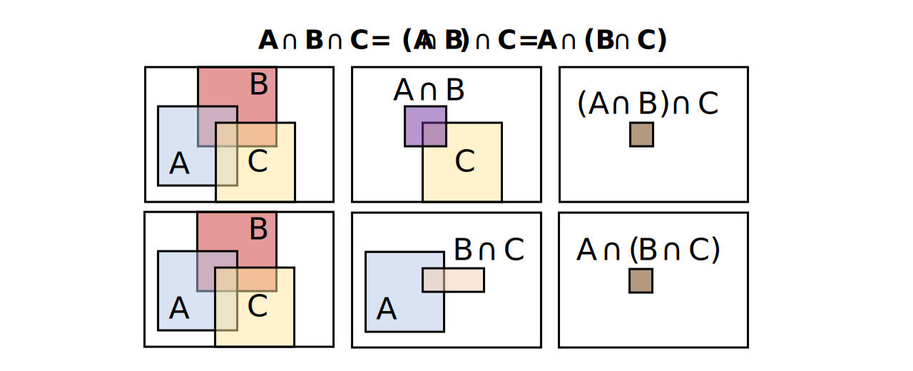
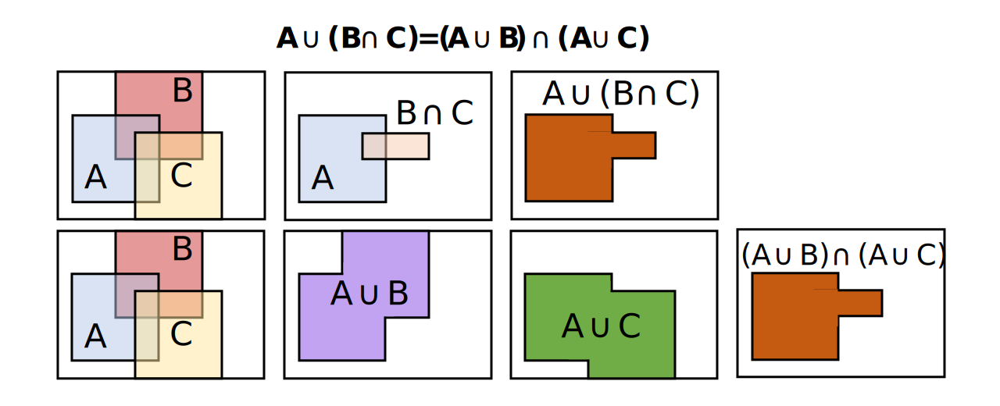
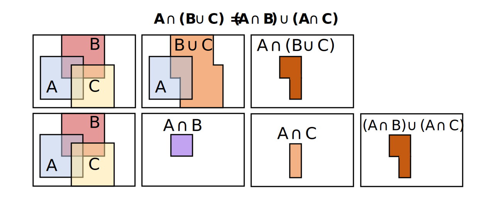
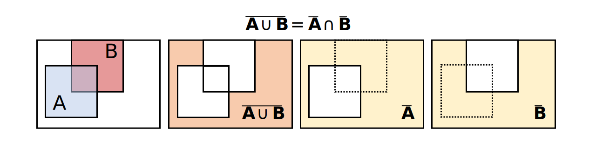
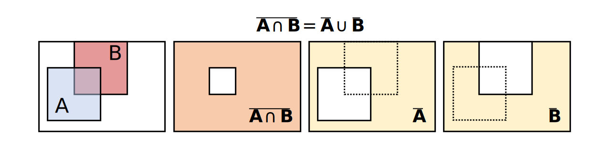

Introduction to set theory
================
Erika Duan
3/5/23

-   <a href="#what-is-a-set" id="toc-what-is-a-set">What is a set?</a>
-   <a href="#working-with-two-or-more-sets"
    id="toc-working-with-two-or-more-sets">Working with two or more sets</a>
-   <a href="#set-algebra" id="toc-set-algebra">Set algebra</a>
    -   <a href="#commutative-laws" id="toc-commutative-laws">Commutative
        laws</a>
    -   <a href="#associative-laws" id="toc-associative-laws">Associative
        laws</a>
    -   <a href="#distributive-laws" id="toc-distributive-laws">Distributive
        laws</a>
    -   <a href="#de-morgans-laws" id="toc-de-morgans-laws">De Morgan’s laws</a>
-   <a href="#resources" id="toc-resources">Resources</a>

<div>

> **Summary**
>
> This tutorial provides a framework for describing element belonging to
> a set, where a set is a collection of distinct elements. Working with
> sets is a prerequisite for understanding probability theory.

</div>

# What is a set?

A set is a collection of distinct objects or elements
().

We reference a set by listing all its elements. *For example,

or

to describe all the possible distinct outcomes when we roll a dice and
observe its upper face.*

Set notation:

-   An example of a **finite set** is
    .
    A finite set is countable by definition.  
-   An example of a **countably infinite set** is
    .
    The set consists of integers which extend from 1 to infinity.  
-   An example of an **uncountably infinite set** is
    ").
    The set is uncountable as it comprises all real numbers between 0
    and 1.  
-   The **null set**
    ()
    does not contain any elements and is denoted by
    .  
-   The **universal set** is denoted by
     and is the set of
    all elements under consideration for a specific scenario.  
-   The **complement** of set
     is the set of
    elements which are in
     but not in
    . This is expressed
    in mathematical notation as
    .  
-   If all elements of set
     are also in set
    , then
     is a **subset** of
     and this is denoted
    as
    .
    There are only two possibilities when this is true, that the number
    of elements in set A are fewer than those in set B or that set A and
    B contain the same elements.  
-   If
    
    and
    ,
    then
    .


# Working with two or more sets

Venn diagrams are useful for conceptually visualising set properties.
However, we still want to use rigorous mathematical proofs when
asserting set properties.

Consider set  and set
 such that a subset of
elements in  are also
found in :

-   The **intersection** of
     and
     contains the set of
    elements found in both
     and
    . This is denoted as
    .  
-   The **union** of 
    and  contains the
    set of elements found in
     or
    . This is denoted as
    .  
-   The set operation
    
    contains the set of elements found in
     that are not found
    in . This is
    equivalent to
    
    and denoted as
    .


Consider set  and set
 such that no elements
in  are found in
:

-   Sets  and
     are mutually
    exclusive or **disjoint** if
    .  
-   Sets ,
     and
     are therefore
    disjoint if
    .



<div class="panel-tabset">

## R

In contrast to Python, R does not have a set data type. However, set
operations `union()`, `intersect(x, y)`, `setdiff(x, y)` and
`setequal(x, y)` exist in base R.

``` r
# Perform set operations in R --------------------------------------------------
a = c(1, 2, 3)
b = c(1, 3, 6)

union(a, b)
#> [1] 1 2 3 6  

intersect(a, b)
#> [1] 1 3  

# setdiff(a, b) is equivalent to a - b 
setdiff(a, b)
#> [1] 2

setequal(a, b)
#> [1] FALSE  
```

## Python

In Python, a set is an unordered data type comprising a collection of
distinct data objects. Sets can be created directly using `{1, 2, 3}` or
`set([1, 2, 3])`.

``` python
# Create a set in Python -------------------------------------------------------
list_a = [1, 2, 2, 3]
set_a = set(list_a)

print(set_a)
#> {1, 2, 3}

type(set_a)
#> <class 'set'>  
```

``` python
# Perform set operations in Python ---------------------------------------------
set_b = {1, 3, 6}
type(set_b)
#> <class 'set'>  

set_a.union(set_b)
#> {1, 2, 3, 6}  

set_a.union(set_b) == set_a | set_b
#> True  

set_a.intersection(set_b)
#> {1, 3}  

set_a.intersection(set_b) == set_a & set_b
#> True  

# a.difference(b) is equivalent to a - b  

set_a.difference(set_b)
#> {2}   

set_a - set_b
#> {2}   

# Python also has an ^ operator which returns all elements in A or B but not AB 

set_a.symmetric_difference(set_b)
#> {2, 6}  

set_a.symmetric_difference(set_b) == set_a ^ set_b
#> True  
```

``` python
# Identify disjoint sets in Python ---------------------------------------------
set_c = {8, 9}
set_a.isdisjoint(set_c)
#> True
```

``` python
# Identify subsets in Python ---------------------------------------------------
set_d = {1, 2, 3, 4}  
set_a.issubset(set_d)
#> True 
```

## Julia

In Julia, inequality statements are also outputted as Boolean values
i.e. `true` or `false`.

``` julia
# Create a set in Julia --------------------------------------------------------
a = Set([1, 2, 3]) 
b = Set([1, 3, 6])

typeof(a)
#> Set{Int64}  
print(a)
#> Set([2, 3, 1])  
```

``` julia
# Perform set operations in Julia ----------------------------------------------
print(union(a, b))
#> Set([6, 2, 3, 1])  

print(intersect(a, b))
#> Set([3, 1])   

print(setdiff(a, b))
#> Set([2])  

# symdiff(a, b) is equivalent to a.symmetric_difference(b) in Python
print(symdiff(a, b))
#> Set([6, 2])
```

</div>

# Set algebra

## Commutative laws

The set order has no impact on the union or intersection of two sets.
This is intuitive as changing the set order does not change contents of
each individual set.

-     
-   



## Associative laws

The set order also has no impact when only either an intersection or
union is performed on more than two sets. This is similarly intuitive to
the commutative laws, as introducing extra sets does not change contents
of each individual set.

-    \cup C = A \cup (B \cup C)")  
-    \cap C = A \cup (B \cap C)")



## Distributive laws

The sequence of first performing the set operation inside the
parenthesis matters when both an intersection and union are applied to
multiple sets. This is similar to how the sequence of first performing
the operation inside the parenthesis matters in elementary algebra. *For
example,
 \neq (2 + 3) \times 4.")*

-    \neq (A \cup B) \cap C")  
-    = (A \cup B) \cap (A \cup C)")



-    \neq (A \cap B) \cup C)")  
-    = (A \cap B) \cup (A \cap C)")



## De Morgan’s laws

De Morgan’s law is less intuitive and can be visualised by Venn diagrams
or (more preferably) proven mathematically.

-   

<div>

> **Proof 1**
>
> Suppose that
>   
> Then
>   
>   
>   
>   
> Therefore,
> 
>
> Similarly, suppose that
>   
> Then
>   
>   
>   
>   
> Therefore,
> 
>
> Therefore,
> 

</div>



-   

<div>

> **Proof 2**
>
> From proof 1,
> 
>
> If we substitute A with
> 
> and B with
>   
>   
>   
> 
>
> Therefore,
> 

</div>



# Resources

-   [Wikipedia entry](https://en.wikipedia.org/wiki/Algebra_of_sets) on
    set algebra.  
-   A [guide](https://realpython.com/python-sets/) on Python set
    operations from Real Python.  
-   A [guide](https://www.geeksforgeeks.org/sets-in-julia/) on Julia set
    operations from GeeksforGeeks.
