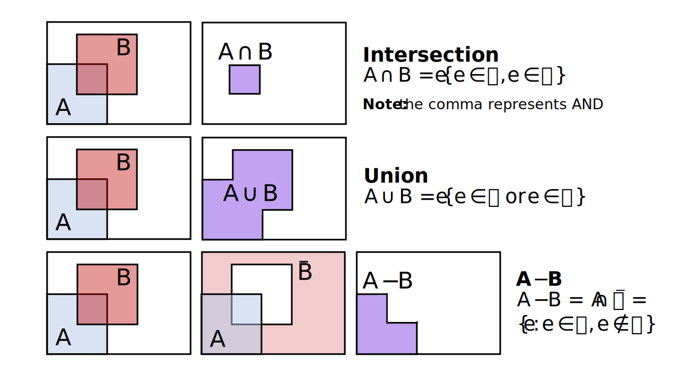

Introduction to set theory
================
Erika Duan
3/3/23

-   <a href="#what-is-a-set" id="toc-what-is-a-set">What is a set?</a>
-   <a href="#working-with-two-or-more-sets"
    id="toc-working-with-two-or-more-sets">Working with two or more sets</a>
-   <a href="#resources" id="toc-resources">Resources</a>

<div>

> **Summary**
>
> This tutorial provides a framework for describing element belonging to
> a set, where a set is a collection of distinct elements. Working with
> sets is a prerequisite for understanding the key properties of
> probability theory.

</div>

# What is a set?

A set is a collection of distinct objects or elements
(). We reference a set
by listing all its elements. *For example,

or

to describe all the possible distinct outcomes when we roll a dice and
observe its upper face.*

Set notation:

-   An example of a finite set is
    .
    A finite set is countable by definition.  
-   An example of a countably infinite set is
    .
    The set consists of integers which extend fro to infinity.  
-   An example of an uncountably infinite set is
    ").
    The set is uncountable as it comprises all real numbers between 0
    and 1.  
-   The **null set**
    ()
    does not contain any elements and is denoted by
    .  
-    is used to denote
    the universal set, which is the set of all objects under
    consideration.  
-   The complement of set
     is the set of
    elements which are in
     but not in
    . This is expressed
    in mathematical notation as
    .  
-   If all elements of set
     are also in set
    , set
     is a subset of set
     and this is denoted
    as
    .
    There are only two possibilities when this is true, that the number
    of elements in set A are fewer than those in set B or that set A and
    B contain the same elements.  
-   If
    
    and
    ,
    then
    .


# Working with two or more sets

Venn diagrams are useful for conceptually visualising set properties.
However, we still want to use rigorous mathematical proofs when
asserting set properties.



<div class="panel-tabset">

## R

R does not have a set data type.

``` r
# Compute inequality in R ------------------------------------------------------
4 <= 4
#> [1] TRUE

4 < 4
#> [1] FALSE

class(4 < 4)
#> [1] "logical"
```

## Python

In Python, inequality statements are also outputted as Boolean values
i.e. `True` or `False`.

``` python
# Compute inequality in Python -------------------------------------------------
4 <= 4
#> True 
```

``` python
type(4 <= 4)
#> <class 'bool'>  
```

## Julia

In Julia, inequality statements are also outputted as Boolean values
i.e. `true` or `false`.

``` julia
# Compute inequality in Julia --------------------------------------------------
4 <= 4
#> true 

typeof(4 <= 4) 
#> true
#> Bool

a = 1
b = 2
c = 3

a < b, a + c < b + c
#> (true, true) 
```

</div>

# Resources

-   [Wikipedia entry](https://en.wikipedia.org/wiki/Algebra_of_sets) on
    set algebra.
